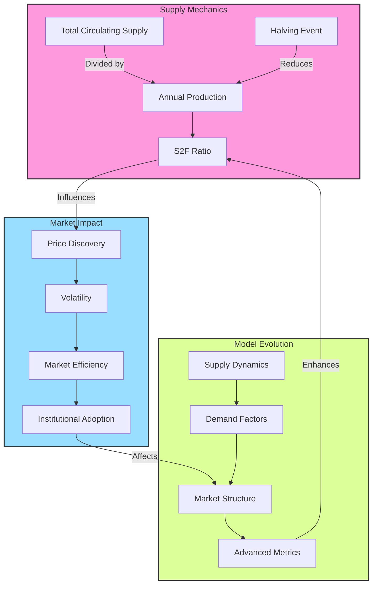
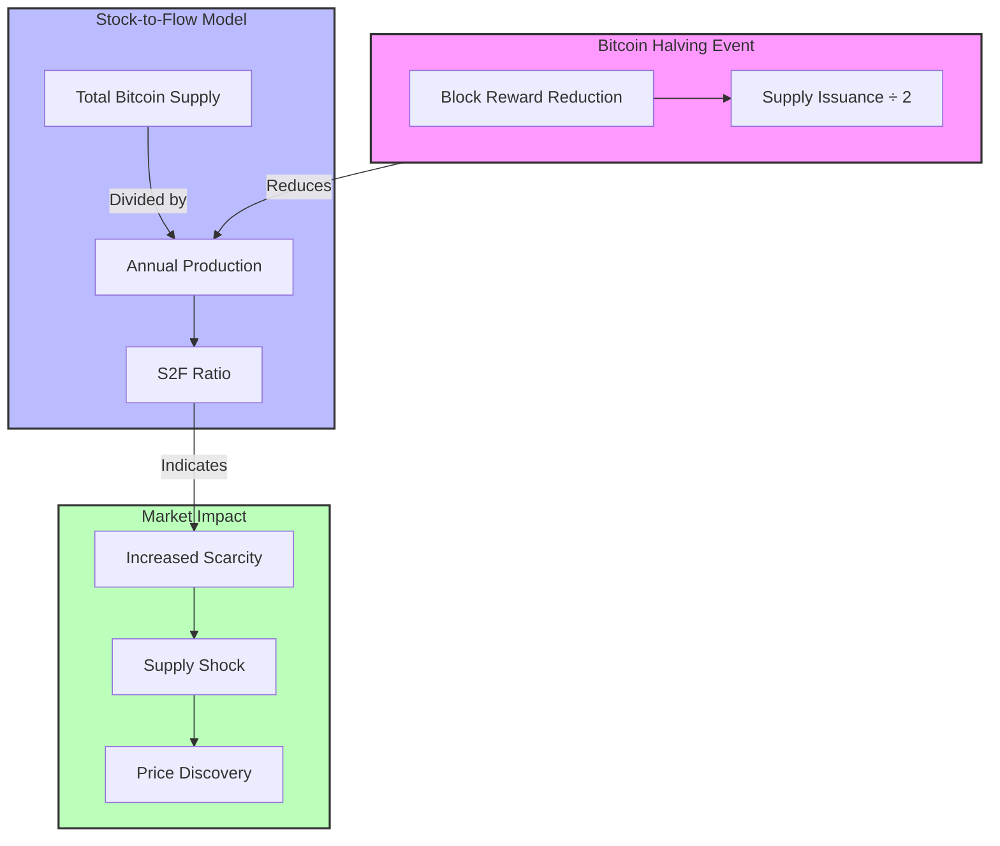

# Bitcoin Stock-to-Flow Analysis: A Comprehensive Framework

## 1. Core Model Mathematics

### Fundamental Equations
- **Basic S2F Formula**: $S2F = \frac{\text{Stock}}{\text{Flow}}$
- **Bitcoin-Specific S2F**: $S2F_{BTC} = \frac{\text{Circulating Supply}}{\text{Annual Issuance}}$

### Historical Progression
| Halving | Date       | Block Height | Stock (M BTC) | Flow (Annual) | S2F Ratio | Price at Event |
|---------|------------|--------------|---------------|---------------|-----------|----------------|
| 2012    | 2012-11-28 | 210,000     | ~10.5M       | ~1.31M       | 8.0       | $12.35         |
| 2016    | 2016-07-09 | 420,000     | ~15.5M       | ~0.66M       | 23.5      | $650           |
| 2020    | 2020-05-11 | 630,000     | ~18.3M       | ~0.33M       | 55.4      | $8,821         |
| 2024    | 2024-04-20 | 840,000     | ~19.5M       | ~0.16M       | 121.9     | $63,842.56     |

## 2. Market Impact Analysis

### Post-Halving Returns (12-Month)
```
2012-2013: +8,134%
2016-2017: +304%
2020-2021: +461%
2024-2025: TBD
```

### Volatility Evolution
```
2012-2016: ~151% annualized
2016-2020: ~93% annualized
2020-2024: ~72% annualized
```

### Market Correlation
- Pre-2020: r > 0.95 (S2F to Price)
- Post-2020: r ≈ 0.85
- Trend: Decreasing correlation indicating market maturation

## 3. Supply Dynamics

### Block Reward Evolution
```
Pre-2012:  50 BTC/block
2012-2016: 25 BTC/block
2016-2020: 12.5 BTC/block
2020-2024: 6.25 BTC/block
2024-2028: 3.125 BTC/block
```

### Future Supply Projections
- Current Supply: ~19.5M BTC
- Maximum Supply: 21M BTC
- Remaining Halvings: 29
- Terminal State: ~0.00000001 BTC/block (2140)

## 4. Market Structure Evolution

### Phase Analysis
1. **Early Phase (Pre-2016)**
   - High predictive power of S2F model
   - Large price movements on supply changes
   - Limited market infrastructure

2. **Middle Phase (2016-2020)**
   - Growing derivatives market
   - Reduced volatility
   - Institutional interest emergence

3. **Current Phase (2020-Present)**
   - ETF integration
   - Mainstream financial adoption
   - Complex market dynamics beyond S2F

### Price Discovery Evolution
- Faster incorporation of halving expectations
- Earlier pricing of supply changes
- Reduced post-halving volatility
- Growing institutional influence

## 5. Advanced Metrics

### Key Ratios
1. **Realized Cap Ratio**
   - Formula: $\text{Market Cap} / \text{Realized Cap}$
   - Purpose: Measures speculative premium

2. **S2F Deviation**
   - Formula: $\text{Actual Price} / \text{S2F Predicted Price}$
   - Purpose: Identifies potential mis-pricing

3. **Mining Revenue Ratio**
   - Formula: $\text{Fee Revenue} / \text{Block Subsidy}$
   - Purpose: Network sustainability indicator

## 6. Future Considerations

### Economic Transitions
1. **Transaction Fee Market**
   - Growing importance of fee revenue
   - Security budget evolution
   - Network sustainability mechanisms

2. **Monetary Properties**
   - Increasing stock-to-flow ratio
   - Supply inelasticity premium
   - Store of value characteristics

### Model Evolution Requirements
1. **Enhanced Demand Metrics**
   - Integration of demand-side factors
   - Market absorption metrics
   - Velocity considerations

2. **Market Structure Adaptations**
   - ETF impact modeling
   - Derivatives market influence
   - Institutional flow tracking

## Model Assessment

### Strengths
1. Quantifies supply scarcity systematically
2. Tracks halving impacts effectively
3. Provides clear valuation framework
4. Captures monetary evolution

### Limitations
1. Demand-side blindness
2. Supply-centric assumptions
3. Market absorption prerequisites
4. Diminishing predictive power

## Conclusion
The Stock-to-Flow model serves as a foundational framework for understanding Bitcoin's monetary evolution. While its predictive power may decrease with market maturation, its core principle of quantifying digital scarcity remains valuable. The model's greatest utility lies in understanding the systematic impact of supply dynamics on Bitcoin's long-term value proposition, particularly when integrated with broader market metrics and institutional considerations.

---


---

1. A Mermaid diagram showing the relationship between halving events, the S2F model, and market impact
2. A comprehensive Markdown analysis that integrates S2F data with halving events

The analysis shows how the S2F ratio has increased dramatically with each halving:
- 2012: S2F = 8
- 2016: S2F = 23.5
- 2020: S2F = 55.4
- 2024: S2F = 121.9

This progression helps explain the decreasing percentage returns after each halving, as the market becomes more efficient at pricing in the known supply changes.



# Bitcoin Stock-to-Flow Analysis

## Stock-to-Flow Progression Through Halvings

| Halving Event | Total Supply (Stock) | Annual Production (Flow) | S2F Ratio | Price at Event |
|---------------|---------------------|------------------------|-----------|----------------|
| 2012          | ~10.5M BTC         | ~1.31M BTC            | 8         | $12.35         |
| 2016          | ~15.5M BTC         | ~0.66M BTC            | 23.5      | $650           |
| 2020          | ~18.3M BTC         | ~0.33M BTC            | 55.4      | $8,821         |
| 2024          | ~19.5M BTC         | ~0.16M BTC            | 121.9     | $63,842.56     |

## S2F Model Impact Analysis

### 1. Supply Dynamics
- **Pre-2012**: High flow rate (50 BTC/block)
  - Lower S2F ratio indicated less scarcity
  - Market was still discovering price mechanisms

- **2012-2016**: First halving impact (25 BTC/block)
  - S2F ratio doubled
  - Marked first major scarcity-driven price discovery

- **2016-2020**: Second halving period (12.5 BTC/block)
  - S2F ratio reached precious metal equivalence
  - Institutional interest began to grow

- **2020-2024**: Third halving era (6.25 BTC/block)
  - S2F ratio exceeded gold
  - Mainstream financial adoption accelerated

- **2024-Present**: Fourth halving (3.125 BTC/block)
  - S2F ratio at historic highs
  - Integration with traditional finance via ETFs

### 2. Model Implications

#### Scarcity Metrics
- Each halving doubles the S2F ratio
- Higher S2F ratios historically correlate with:
  - Increased hodling behavior
  - Reduced selling pressure
  - Greater price discovery periods

#### Market Maturation
- **Early Phase** (pre-2016)
  - S2F model showed strong predictive power
  - Large price movements on supply changes

- **Middle Phase** (2016-2020)
  - Model accuracy remained high
  - Reduced volatility in price responses

- **Current Phase** (2020-present)
  - More complex market dynamics
  - Additional factors beyond S2F affecting price

### 3. Critical Considerations

#### Model Strengths
1. Quantifies supply scarcity
2. Tracks halving impacts systematically
3. Provides framework for value analysis

#### Model Limitations
1. Doesn't account for demand fluctuations
2. May overemphasize supply factors
3. Assumes continuous market absorption

## Future Projections

### Next Halving (2028)
- Projected S2F Ratio: ~240
- Block Reward: 1.5625 BTC
- Supply Impact: Further reduction in new issuance
- Market Implications:
  - Potential for increased scarcity premium
  - More emphasis on transaction fees
  - Greater focus on Bitcoin as a store of value

### Long-term Considerations
1. **Diminishing Supply Impact**
   - Reduced effect of future halvings on total supply
   - Greater importance of lost coins in circulating supply

2. **Market Evolution**
   - Integration with traditional financial systems
   - Development of sophisticated derivatives markets
   - Potential regulatory frameworks

3. **Model Adaptation**
   - Need for enhanced models incorporating demand metrics
   - Integration with broader market indicators
   - Evolution beyond pure S2F calculations

## Conclusion
The Stock-to-Flow model provides valuable insights into Bitcoin's monetary properties and supply dynamics. While not perfect, it helps explain the impact of halvings on market behavior and price discovery. As the market matures, the model may need to evolve to incorporate additional factors, but its core principle of measuring scarcity remains relevant to understanding Bitcoin's value proposition.

---

# Bitcoin Stock-to-Flow and Time Series Analysis

## 1. Stock-to-Flow Model Framework

### Mathematical Foundation
- **Basic S2F Formula**: $S2F = \frac{\text{Stock}}{\text{Flow}}$
- **Stock**: Total circulating supply
- **Flow**: Annual production rate
- **Bitcoin-Specific S2F**: $S2F_{BTC} = \frac{\text{Circulating Supply}}{\text{Annual Issuance}}$

### Halving Impact on S2F
| Event | Date       | Block Height | Stock (M BTC) | Flow (Annual) | S2F Ratio | Market Cap at Event |
|-------|------------|-------------|---------------|--------------|-----------|-------------------|
| H1    | 2012-11-28 | 210,000     | ~10.5        | ~1.31M      | 8.0      | $129M             |
| H2    | 2016-07-09 | 420,000     | ~15.5        | ~0.66M      | 23.5     | $10.1B            |
| H3    | 2020-05-11 | 630,000     | ~18.3        | ~0.33M      | 55.4     | $161.4B           |
| H4    | 2024-04-20 | 840,000     | ~19.5        | ~0.16M      | 121.9    | ~$1.24T           |

## 2. Time Series Components

### Trend Analysis
- **Long-term (Secular) Trend**: 
  - Clear upward trajectory in both S2F ratio and price
  - Exponential growth pattern with diminishing rate
- **Cyclical Components**:
  - 4-year cycles aligned with halving events
  - Post-halving appreciation periods typically lasting 12-18 months

### Moving Average Analysis
1. **Pre-Halving Period (3 months prior)**:
   - Price typically consolidates
   - Accumulation phase observed
   
2. **Post-Halving Impact (12 months after)**:
   - Historical price appreciation:
     - 2012: 8,134% gain
     - 2016: 304% gain
     - 2020: 461% gain
     - 2024: TBD

## 3. Statistical Properties

### Correlation Analysis
- **S2F to Price Correlation**:
  - Pre-2020: Strong positive correlation (r > 0.95)
  - Post-2020: Moderating correlation (r ≈ 0.85)
  - Indicates market maturation

### Volatility Patterns
```
Annualized Volatility by Halving Epoch:
2012-2016: ~151%
2016-2020: ~93%
2020-2024: ~72%
```

## 4. Model Evolution and Market Efficiency

### Efficiency Metrics
1. **Price Discovery Efficiency**:
   - Faster incorporation of halving expectations
   - Reduced post-halving volatility
   - Growing institutional participation

2. **Market Depth Indicators**:
   - 2012: Limited spot market liquidity
   - 2016: Growing derivatives market
   - 2020: Institutional adoption begins
   - 2024: Mature market structure with ETFs

### Adaptive Expectations
- Market participants increasingly price in halving events earlier
- Forward-looking behavior evident in derivatives markets
- Reduced surprise element with each subsequent halving

## 5. Technical Considerations for Future Halvings

### Supply Dynamics
1. **Terminal Supply Impact**:
   - Current Supply: ~19.5M BTC
   - Maximum Supply: 21M BTC
   - Remaining Halvings: 29
   - Final Block Reward: ~0.00000001 BTC (2140)

2. **Diminishing Supply Impact**:
   ```
   Issuance Reduction Impact:
   2024-2028: -50% (3.125 → 1.5625 BTC)
   2028-2032: -50% (1.5625 → 0.78125 BTC)
   2032-2036: -50% (0.78125 → 0.390625 BTC)
   ```

### Economic Implications
1. **Transaction Fee Market**:
   - Growing importance of fee revenue
   - Potential security budget transitions
   - Network sustainability considerations

2. **Monetary Properties**:
   - Increasing stock-to-flow ratio
   - Enhanced store of value characteristics
   - Potential for supply inelasticity premium

## 6. Future Projections and Considerations

### Model Limitations
1. **Supply-Side Focus**:
   - Does not directly account for demand dynamics
   - Assumes continuous market absorption
   - May overemphasize supply factors

2. **Market Structure Evolution**:
   - Impact of institutional adoption
   - ETF-driven price discovery
   - Regulatory framework development

### Advanced Metrics
1. **Realized Cap Ratio**: $\text{Market Cap} / \text{Realized Cap}$
2. **Stock-to-Flow Deviation**: $\text{Actual Price} / \text{S2F Predicted Price}$
3. **Mining Revenue Ratio**: $\text{Fee Revenue} / \text{Block Subsidy}$

## Conclusion
The Stock-to-Flow model provides a quantitative framework for understanding Bitcoin's supply dynamics and their impact on market value. While the model's predictive power may diminish as the market matures, it remains valuable for understanding the fundamental scarcity mechanics driving Bitcoin's long-term value proposition. The integration of technical analysis and market structure considerations enhances the model's utility for comprehensive market analysis.
