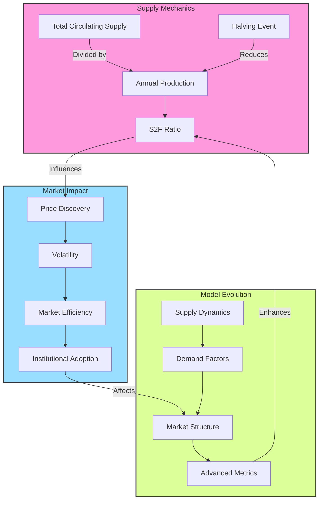

# Bitcoin Stock-to-Flow Analysis: A Comprehensive Framework

## 1. Core Model Mathematics

### Fundamental Equations
- **Basic S2F Formula**: $S2F = \frac{\text{Stock}}{\text{Flow}}$
- **Bitcoin-Specific S2F**: $S2F_{BTC} = \frac{\text{Circulating Supply}}{\text{Annual Issuance}}$

### Historical Progression
| Halving | Date       | Block Height | Stock (M BTC) | Flow (Annual) | S2F Ratio | Price at Event |
|---------|------------|--------------|---------------|---------------|-----------|----------------|
| 2012    | 2012-11-28 | 210,000     | ~10.5M       | ~1.31M       | 8.0       | $12.35         |
| 2016    | 2016-07-09 | 420,000     | ~15.5M       | ~0.66M       | 23.5      | $650           |
| 2020    | 2020-05-11 | 630,000     | ~18.3M       | ~0.33M       | 55.4      | $8,821         |
| 2024    | 2024-04-20 | 840,000     | ~19.5M       | ~0.16M       | 121.9     | $63,842.56     |

## 2. Market Impact Analysis

### Post-Halving Returns (12-Month)
```
2012-2013: +8,134%
2016-2017: +304%
2020-2021: +461%
2024-2025: TBD
```

### Volatility Evolution
```
2012-2016: ~151% annualized
2016-2020: ~93% annualized
2020-2024: ~72% annualized
```

### Market Correlation
- Pre-2020: r > 0.95 (S2F to Price)
- Post-2020: r ≈ 0.85
- Trend: Decreasing correlation indicating market maturation

## 3. Supply Dynamics

### Block Reward Evolution
```
Pre-2012:  50 BTC/block
2012-2016: 25 BTC/block
2016-2020: 12.5 BTC/block
2020-2024: 6.25 BTC/block
2024-2028: 3.125 BTC/block
```

### Future Supply Projections
- Current Supply: ~19.5M BTC
- Maximum Supply: 21M BTC
- Remaining Halvings: 29
- Terminal State: ~0.00000001 BTC/block (2140)

## 4. Market Structure Evolution

### Phase Analysis
1. **Early Phase (Pre-2016)**
   - High predictive power of S2F model
   - Large price movements on supply changes
   - Limited market infrastructure

2. **Middle Phase (2016-2020)**
   - Growing derivatives market
   - Reduced volatility
   - Institutional interest emergence

3. **Current Phase (2020-Present)**
   - ETF integration
   - Mainstream financial adoption
   - Complex market dynamics beyond S2F

### Price Discovery Evolution
- Faster incorporation of halving expectations
- Earlier pricing of supply changes
- Reduced post-halving volatility
- Growing institutional influence

## 5. Advanced Metrics

### Key Ratios
1. **Realized Cap Ratio**
   - Formula: $\text{Market Cap} / \text{Realized Cap}$
   - Purpose: Measures speculative premium

2. **S2F Deviation**
   - Formula: $\text{Actual Price} / \text{S2F Predicted Price}$
   - Purpose: Identifies potential mis-pricing

3. **Mining Revenue Ratio**
   - Formula: $\text{Fee Revenue} / \text{Block Subsidy}$
   - Purpose: Network sustainability indicator

## 6. Future Considerations

### Economic Transitions
1. **Transaction Fee Market**
   - Growing importance of fee revenue
   - Security budget evolution
   - Network sustainability mechanisms

2. **Monetary Properties**
   - Increasing stock-to-flow ratio
   - Supply inelasticity premium
   - Store of value characteristics

### Model Evolution Requirements
1. **Enhanced Demand Metrics**
   - Integration of demand-side factors
   - Market absorption metrics
   - Velocity considerations

2. **Market Structure Adaptations**
   - ETF impact modeling
   - Derivatives market influence
   - Institutional flow tracking

## Model Assessment

### Strengths
1. Quantifies supply scarcity systematically
2. Tracks halving impacts effectively
3. Provides clear valuation framework
4. Captures monetary evolution

### Limitations
1. Demand-side blindness
2. Supply-centric assumptions
3. Market absorption prerequisites
4. Diminishing predictive power

## Conclusion
The Stock-to-Flow model serves as a foundational framework for understanding Bitcoin's monetary evolution. While its predictive power may decrease with market maturation, its core principle of quantifying digital scarcity remains valuable. The model's greatest utility lies in understanding the systematic impact of supply dynamics on Bitcoin's long-term value proposition, particularly when integrated with broader market metrics and institutional considerations.

---


