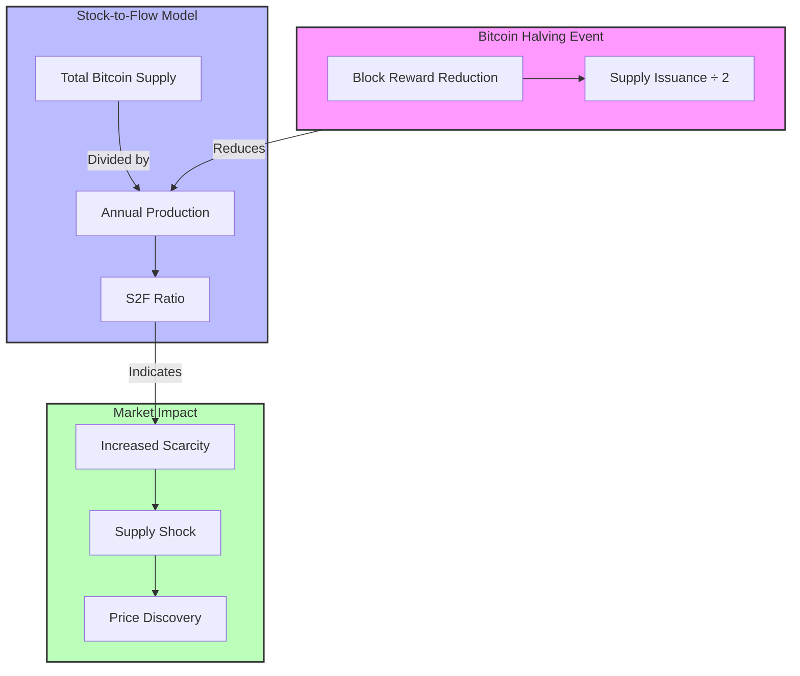

1. A Mermaid diagram showing the relationship between halving events, the S2F model, and market impact
2. A comprehensive Markdown analysis that integrates S2F data with halving events

The analysis shows how the S2F ratio has increased dramatically with each halving:
- 2012: S2F = 8
- 2016: S2F = 23.5
- 2020: S2F = 55.4
- 2024: S2F = 121.9

This progression helps explain the decreasing percentage returns after each halving, as the market becomes more efficient at pricing in the known supply changes.

# Bitcoin Stock-to-Flow Analysis

## Stock-to-Flow Progression Through Halvings

| Halving Event | Total Supply (Stock) | Annual Production (Flow) | S2F Ratio | Price at Event |
|---------------|---------------------|------------------------|-----------|----------------|
| 2012          | ~10.5M BTC         | ~1.31M BTC            | 8         | $12.35         |
| 2016          | ~15.5M BTC         | ~0.66M BTC            | 23.5      | $650           |
| 2020          | ~18.3M BTC         | ~0.33M BTC            | 55.4      | $8,821         |
| 2024          | ~19.5M BTC         | ~0.16M BTC            | 121.9     | $63,842.56     |

## S2F Model Impact Analysis

### 1. Supply Dynamics
- **Pre-2012**: High flow rate (50 BTC/block)
  - Lower S2F ratio indicated less scarcity
  - Market was still discovering price mechanisms

- **2012-2016**: First halving impact (25 BTC/block)
  - S2F ratio doubled
  - Marked first major scarcity-driven price discovery

- **2016-2020**: Second halving period (12.5 BTC/block)
  - S2F ratio reached precious metal equivalence
  - Institutional interest began to grow

- **2020-2024**: Third halving era (6.25 BTC/block)
  - S2F ratio exceeded gold
  - Mainstream financial adoption accelerated

- **2024-Present**: Fourth halving (3.125 BTC/block)
  - S2F ratio at historic highs
  - Integration with traditional finance via ETFs

### 2. Model Implications

#### Scarcity Metrics
- Each halving doubles the S2F ratio
- Higher S2F ratios historically correlate with:
  - Increased hodling behavior
  - Reduced selling pressure
  - Greater price discovery periods

#### Market Maturation
- **Early Phase** (pre-2016)
  - S2F model showed strong predictive power
  - Large price movements on supply changes

- **Middle Phase** (2016-2020)
  - Model accuracy remained high
  - Reduced volatility in price responses

- **Current Phase** (2020-present)
  - More complex market dynamics
  - Additional factors beyond S2F affecting price

### 3. Critical Considerations

#### Model Strengths
1. Quantifies supply scarcity
2. Tracks halving impacts systematically
3. Provides framework for value analysis

#### Model Limitations
1. Doesn't account for demand fluctuations
2. May overemphasize supply factors
3. Assumes continuous market absorption

## Future Projections

### Next Halving (2028)
- Projected S2F Ratio: ~240
- Block Reward: 1.5625 BTC
- Supply Impact: Further reduction in new issuance
- Market Implications:
  - Potential for increased scarcity premium
  - More emphasis on transaction fees
  - Greater focus on Bitcoin as a store of value

### Long-term Considerations
1. **Diminishing Supply Impact**
   - Reduced effect of future halvings on total supply
   - Greater importance of lost coins in circulating supply

2. **Market Evolution**
   - Integration with traditional financial systems
   - Development of sophisticated derivatives markets
   - Potential regulatory frameworks

3. **Model Adaptation**
   - Need for enhanced models incorporating demand metrics
   - Integration with broader market indicators
   - Evolution beyond pure S2F calculations

## Conclusion
The Stock-to-Flow model provides valuable insights into Bitcoin's monetary properties and supply dynamics. While not perfect, it helps explain the impact of halvings on market behavior and price discovery. As the market matures, the model may need to evolve to incorporate additional factors, but its core principle of measuring scarcity remains relevant to understanding Bitcoin's value proposition.
